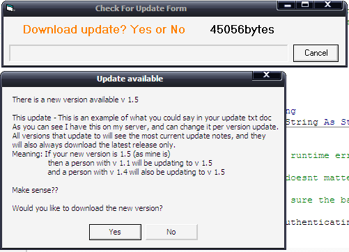



## ultimate auto update\(no self depencies required\)

### Description

This code if added to your project will enable you to release updates to your end users with no fuss at all. This code is fully contained in a single form. You can add the form to any project that you want to have this feature and with a few simple server side chores your end users will get your updates when you release them.

The updater form has a very simple process, it tells the user what has been updated or added in the new version, and gives them an option to update or not. The end user can cancel the update at any stage also. The update interface comes with a fully working progress bar, aswell as a percentage downloaded in the form caption.

Also I have included a developer option to disable the program from being used (optional, novalty realy), meaning that you can stop your end users from using your program if you wish.

If you like this example then please vote and comment. If you would like to see this access a database instead of txt docs/html then say so in the comments section and i will include it... if you like it vote it. Makes perfect use of a batch file to complete the update process, completely removing the need of any dependency in that area.
 
### More Info
 

             |
---                |---
**Submitted On**   |2007-05-11 23:25:10
**By**             |[Puddy Davidson](https://github.com/Planet-Source-Code/PSCIndex/blob/master/ByAuthor/puddy-davidson.md)
**Level**          |Intermediate
**User Rating**    |4.7 (166 globes from 35 users)
**Compatibility**  |VB 6\.0
**Category**       |[Miscellaneous](https://github.com/Planet-Source-Code/PSCIndex/blob/master/ByCategory/miscellaneous__1-1.md)
**World**          |[Visual Basic](https://github.com/Planet-Source-Code/PSCIndex/blob/master/ByWorld/visual-basic.md)
**Archive File**   |[ultimate\_a2065185112007\.zip](https://github.com/Planet-Source-Code/puddy-davidson-ultimate-auto-update-no-self-depencies-required__1-68490/archive/master.zip)

